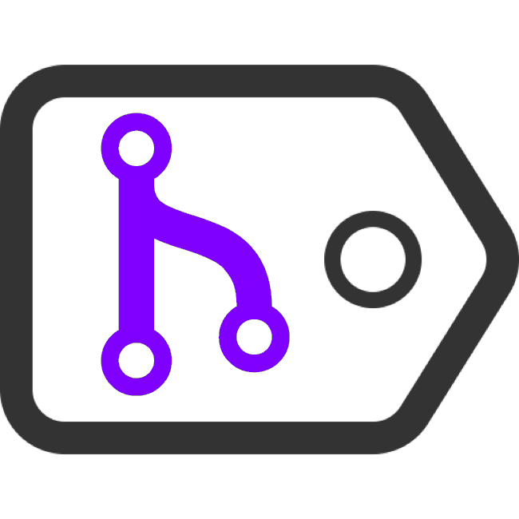

<p align="center">
  <a href="https://ipts.io"></a>
</p>

# IPTS

> InterPlanetary Tagging Service -- ipts.io

IPTS is the tagging service for associating git-style tags (i.e. head) with IPFS hashes and visa versa.

## Install

````
npm install ipts
````

````
const { get, set, remove } = require("ipts")

const run = async () => {
  console.log('get', await get("hellothere"))
  console.log('set', await set("hellothere", Math.random() * 1000))
  console.log('get', await get("hellothere"))
  console.log('remove', await remove("hellothere"))
  console.log('get', await get("hellothere"))
}

run()
````
